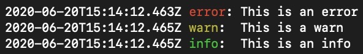

# lowe

## About

With the lowe your logs will be more beautiful and organized, it was made to be used in NodeJS and ExpressJS applications

## Installing

```sh
  npm install lowe --save

  #or

  yarn add lowe
```

## How to use

### Express

```javascript
const express = require('express');
const { middleware } = require('lowe');

const app = express();

/*
 * if you don't pass any parameter the default value is 'tiny'
 */
app.use(middleware('combined'));
```

🚨🚨🚨 Lowe uses same formats of the **morgan** 🚨🚨🚨

### NodeJS

```javascript
const { logger } = require('lowe');

logger.error('This is an error');
logger.warn('This is a warn');
logger.info('This is an info');
```

## Issues

Please, if you find any issue or want to make any improvements open a Pull Request

## Pull Requests

When to create a Pull Request your base branch will be `develop`

## Examples


